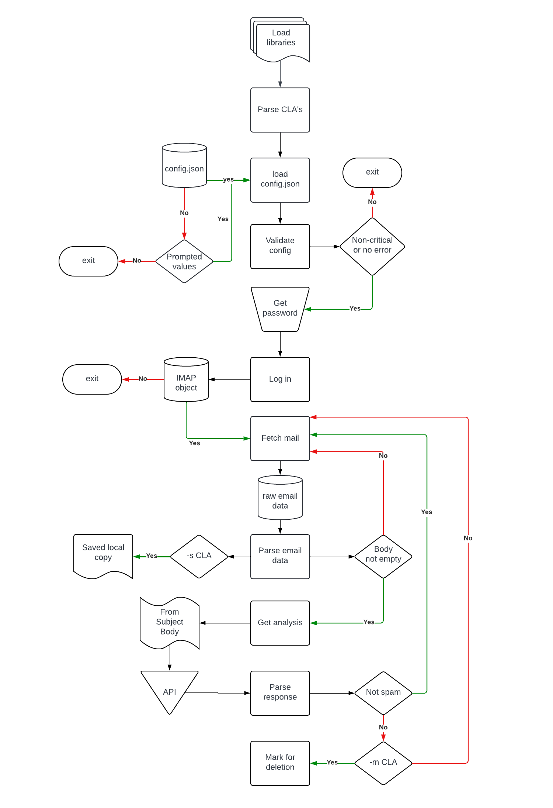

# DuckingSpam
#### [DuckingSpam live YouTube demo](https://www.youtube.com/watch?v=0Bk54__eaJ8)
#### Description: AI Powered Spam Protection

#### Summary
DuckingSpam is a highly effective LLM powered spam filtering script designed to classify and manage IMAP-enabled mailboxes using OpenAI's API.  Once classified as spam, email items can be optionally moved (to "Junk" for instance), or simply saved for review.  The entire process is verbosely logged in the terminal.  Configuration is made through 'config.json', and command line arguments provide further controls.

#### Limitations and application
IMAP functionality is limited to non-OAuth servers (such as Posteo.de).  Unfortunately this excludes most major email providers, however, the providers may themselves already implement such AI based spam detection.  Complete functionality could be said to have been achieved with the incorporation a UI and IMAP idle.  These were considered, but for the sake of practicality, have been put on the "TODO" list for now :)


#### Requirements
The "meat and bones" of this script are an IMAP library, mail-parser, and of course, Openai's API:
1. [imaplib](https://docs.python.org/3/library/imaplib.html, 'IMAP4 protocol client'): A built-in library that connects to and interacts with IMAP servers
2. [mailparser](https://pypi.org/project/mail-parser/, 'mail-parser 3.15.0'): A library that parses fetched emails (from/subject/body)
3. [openai](https://platform.openai.com/docs/api-reference?lang=python, 'OpenAI API'): Official OpenAI Python client library used with the OpenAI API.

##### Usage
**It is important that you first determine whether your email provider requires OAuth/ OAuth 2.0 (Such as Gmail, Yahoo, Outlook.  If not, proceed:*
1. [Install dependencies](.requirements.txt)
2. [Get an OpenAI API key](https://platform.openai.com/docs/quickstart?context=python)
3. Open config.json and enter:
   1. Your API key into `apiKey`
   2. IMAP details published by your email provider into `serverName`, `email` and `port`
   3. `max_emails` - keep in mind the API usage.  It doesn't exactly happen at light speed but be conservative here, particularly when testing.
   4. Decide which folder you want to scan.  Typically this would be 'inbox'.  Enter this into `searchFolder`
   5. Decide which folder you want the spam moved.  Enter this into `spamFolder`
   6. `system` *is where the magic happens*.  **It's probably a great place to break the program also** :)  Remember, So long as the API returns a message that begins with "-Not" or "-Spam" (with provisions for a space between word and dash), it will continue.
   7. OpenAI lists several models that work well for chat completions, including a subsets of [GPT-3.5 Turbo](https://platform.openai.com/docs/models/gpt-3-5-turbo) and [GPT-4 and GPT-4 Turbo](https://platform.openai.com/docs/models/gpt-4-and-gpt-4-turbo).  I have tested extensively with GPT-3.5 Turbo and found it to be quite adequate, however there is no doubt that over a much larger set of test, classification improvements would be expected with the GPT 4 models. Enter your preferred model into `model` exactly as listed in the OpenAI website (above links).
4. Once config.json has been set up, note the following command line arguments and proceed as you wish!
`  -m, --move-flagged-mail`
Move mail flagged as spam from `searchFolder` to `spamFolder`
`-s, --save-local-copy`
Save a local copy of all parsed mail
###
Run with all features using:
#### > `python project.py -s -m`
###
#### File structure
```
└── 📁final
    └── README.md
    └── config.json
    └── overview.txt
    └── project.py
    └── project_flow.png
    └── requirements.txt
    └── test_project.py
    └── 📁saved_emails
    └── 📁testing
        └── not_spam_1.pld
        └── not_spam_2.pld
        └── not_spam_3.pld
        └── spam_1.pld
        └── spam_2.pld
        └── spam_3.pld
```

##### `README.md`
You're reading it right now!
##### `config.json`
Primary configuration file with which IMAP and API details are provided
##### `overview.txt`
Project overview
##### `project.py`
Main python script for DuckingSpam
##### `project_flow.png`
Flow chart (shown below)
##### `requirements`
Library dependencies
##### `saved_emails`
Directory inside which retrieved emails are stored
##### `testing`
Emails used by test_project.py for API response testing.

#### Logic flow


#### Testing
Tests were performed on the API using saved payloads (parsed emails).  Altering the `system` message, thus changing the sensitivity or method of classification will undoubtably affect further test results ran on similar payloads.  Not to worry - just rename the prefix of the test files to what you expect the API to return!  (Or make your own dummy emails).  Thorough tests were performed on most known configuration wildcards.  Although not covered in CS50P, it was super interesting to learn of the power of pytest's parametrize - so I've used it in this project.

Admittedly, it was challenging to test all functions from project.py due to the parameters that were passed around (IMAP objects, raw email data).  The code was refactored so that I could at least pass the payload object around for testing with pytest!  It ended up looking more readable so it was a win-win. -Jay
